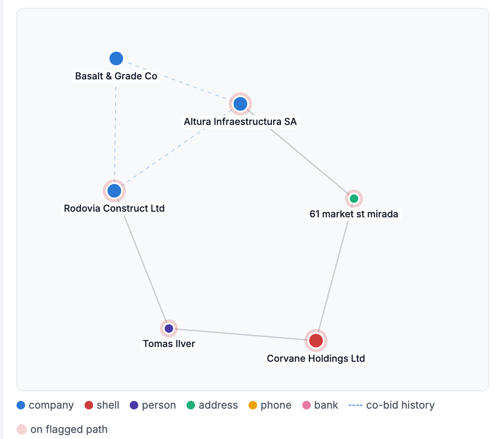

# Procurement Integrity Review Agent

A prototype that is designed to help the World Bank's Integrity Vice Presidency (INT) decide which procurement cases deserve an analyst's time, and gives the analyst evidence they can defend.

> **Synthetic data only.** The fictional "Republic of Veloria" corpus is generated by `data/generate.py`; guidance paraphrases public World Bank documents.

## The problem

1. **Far more allegations than investigators.** In FY25 INT received **4,268 complaints** and opened **65 external investigations**, roughly 1 in 65 ([source](https://www.mayerbrown.com/en/insights/publications/2026/02/the-world-bank-group-enforcement-trends-and-insights-from-fy2025)). Triage is the bottleneck.
2. **The strongest evidence sits between documents.** INT's guidance notes that some abuse "can only be spotted across several bids", such as firms rotating wins or bidding through "subsidiaries or affiliates" ([source](https://documents1.worldbank.org/curated/en/223241573576857116/pdf/Warning-Signs-of-Fraud-and-Corruption-in-Procurement.pdf)). One bid report can't show that.
3. **Outputs must survive due process.** Sanctions go through a contested, two-tier process. An AI tool that invents a quote or calls a firm "corrupt" is worse than no tool.
4. **It must fit INT's stack:** Azure and Databricks, under World Bank Group security and data-classification rules.

## What it does

| Problem | Response |
|---|---|
| Too many cases | Deterministic screening scores **every** tender and ranks leads by risk × value. **100,000 tenders in 2.3 s**; 0.4% go forward. The AI agent only sees those. |
| Evidence between documents | A Claude agent plans the investigation and delegates to a **Network Analyst subagent** that searches the ownership graph and bidding history. |
| Due process | A **verifier** rejects any flag whose quote, graph path or citation can't be confirmed. Non-accusatory wording, human sign-off on every flag, **tamper-evident audit log**. |
| INT's stack | Containerised FastAPI service, Azure DevOps pipeline with an eval gate, OpenTelemetry for App Insights, mapped path to Delta tables and Azure AI Search. |


*A Spanish road tender that passes every single-document check. The agent finds two "competing" bidders linked through a shell company, part of a ring that rotated wins across 14 past tenders.*

<p align="center"></p>

*The hidden link: Rodovia → shared director → shell company → shared address → Altura. Dashed lines are co-bidding history.*

## Quick start

```bash
make setup                 # Python 3.11+ venv, npm install, demo corpus
make build && make api     # http://localhost:8000
```
Runs fully offline with a scripted planner. For the Claude agent, set `ANTHROPIC_API_KEY` in `.env`. Also: `make test`, `make eval`, `make bench`.

## How it works

```
all contracts ─► screening (rules + patterns + graph) ─► ranked leads ─► agent ─► verifier ─► human ─► audit log
```

- **Agent:** `claude-opus-5-5` orchestrator over 11 read-only tools, `claude-sonnet-5-5` Network Analyst subagent, `claude-haiku-4-5` extraction. Step and cost budgets; if the LLM fails, the deterministic baseline completes the review.
- **Retrieval:** hybrid BM25 + multilingual embeddings over 26 cited chunks of World Bank guidance. Only chunks retrieved in a review can be cited.
- **Baseline guarantee:** every rule or pattern signal must be flagged or dismissed with a reason, so neither the agent nor an injected instruction can silently drop evidence.
- **Guardrails:** PII pseudonymised before any LLM call, multilingual prompt-injection screen, confidence computed from verifiable checks, not the model's opinion.

Details: [architecture](docs/architecture.md) · [model card](docs/model_card.md) · [Responsible AI checklist](docs/responsible_ai_checklist.md) · [runbook](docs/runbook.md) · [reviewer guide](docs/reviewer_guide.md)

## Results (synthetic data)

| | |
|---|---|
| Screening, 100,000 tenders | 2.3 s · 409 leads (0.41%) · all planted cases recovered · precision@100 = 100% |
| Document evals, 9 samples (offline planner) | precision 100%, recall 95% · 0 false positives on the clean doc · prompt injection resisted |
| Missed by offline planner | tailored specifications (needs the LLM, by design) |

Claude-mode evals are not yet published; `make eval` with an API key produces them. Full tables: [evals](evals/results/latest.md) · [benchmark](evals/results/bench.md).

## Limitations

- Synthetic data with cleanly planted patterns: results show the pipeline works as designed, not real-world detection rates.
- Thresholds are illustrative, not World Bank policy. PII detection is regex-based; the injection screen is heuristic.
- No authentication yet; production needs Entra ID, RBAC by data classification and Key Vault.
