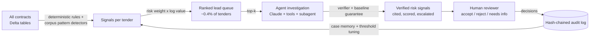
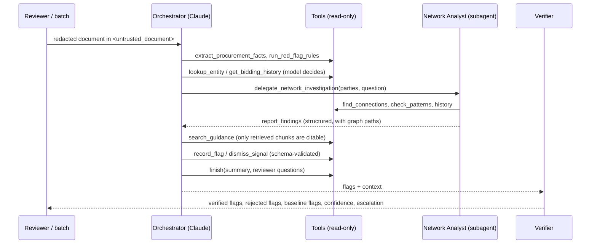
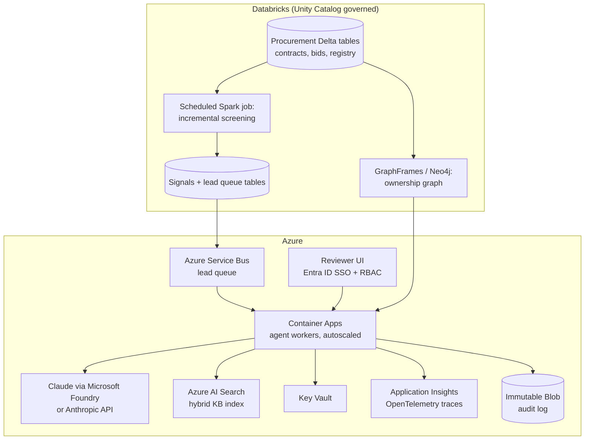

# Architecture

## 1. Design principle: a review funnel

Integrity review is constrained by **reviewer capacity**, not compute. INT received 4,268 complaints in FY25 and opened 65 external investigations ([summary of the FY25 Sanctions System Annual Report](https://www.mayerbrown.com/en/insights/publications/2026/02/the-world-bank-group-enforcement-trends-and-insights-from-fy2025)). Bank-financed procurement adds far more contracts than any team can read. So the system is a funnel. Cheap, explainable checks run on everything. The expensive agent runs only on what ranks highest. Humans decide.

## 2. Prototype components

| Layer | Module | What it does |
|---|---|---|
| Data | `data/generate.py` | Synthetic Delta-table-shaped corpus (companies, persons, directors, entities, tenders, bids). Five planted patterns + honest noise (innocent shared directors, thin markets) |
| Screening | `analytics/patterns.py`, `screening.py` | Vectorised detectors: co-bidding, rotation + cover-bid stability, HHI-style concentration, temporal splitting, new firms, single-tender rules. Lead score = risk × exposure |
| Graph | `analytics/graph.py` | Company ↔ person/address/phone/bank graph. Connected components find every linked co-bidder pair in O(V+E). Bounded shortest paths explain a specific link |
| Entity resolution | `analytics/entity_resolution.py` | Normalisation + blocking keys + fuzzy match inside a block (no O(n²)) |
| Rules | `analytics/rules.py` | R1–R7 single-document red flags, each with a verbatim evidence line |
| Retrieval | `rag/hybrid_index.py` | BM25 + multilingual embeddings (fastembed), Reciprocal Rank Fusion. BM25-only fallback |
| Agent | `agent/planners.py`, `tools.py` | Claude orchestrator loop over 11 typed tools. Network Analyst subagent with a fresh context and graph tools only. Scripted offline planner over the same tools |
| Verification | `agent/verify.py`, `score.py` | Quote / path / citation / language checks, baseline guarantee, computed confidence, escalation |
| Guardrails | `guardrails/` | PII pseudonymisation, multilingual injection screen, non-accusatory language policy |
| Audit | `audit/log.py` | Append-only JSONL, SHA-256 hash chain, reviewer decisions as linked entries, idempotency cache, case memory |
| API | `main.py` | FastAPI: SSE review stream, screening, batch, graph, decisions, audit, evals |
| UI | `frontend/` | React: Portfolio Screening → Agent Review (live trace, evidence view, network graph) → Evals & Scale |

## 3. The agent loop

Controls:
- step, subagent-step and dollar budgets
- the tool allowlist differs per agent
- every tool is read-only, and arguments are Pydantic-validated, so errors go back to the model for self-correction
- one `tool_result` message per turn, which keeps parallel tool calls working
- append-only history, which keeps the prompt-cache prefix stable

**Model tiering:**
- **Orchestrator:** `claude-opus-5-5`, effort `medium`, adaptive thinking with summarised display, which feeds the trace view.
- **Subagent:** `claude-sonnet-5-5`.
- **Extraction:** `claude-haiku-4-5`, with Pydantic structured output.

Server-side refusal fallback (`fallbacks: "default"`) is enabled on the orchestrator and the subagent. If any LLM call fails, the scripted planner completes the review, so the deterministic baseline always produces a result.

## 4. Production architecture on the INT stack (proposed)

| Prototype | Production |
|---|---|
| pandas + networkx, single process | Spark jobs on Databricks, partitioned by entity and period, run incrementally on new contracts |
| CSV corpus | Delta tables with Unity Catalog lineage and column-level access control |
| fastembed + BM25 in memory | Azure AI Search hybrid (BM25 + vector + semantic ranker) |
| ThreadPoolExecutor (3 workers) | Service Bus queue + Container Apps autoscaling. Anthropic Message Batches for overnight bulk (asynchronous, lower cost) |
| JSONL hash chain | Immutable Blob storage + Log Analytics, with retention per records policy |
| `.env` | Key Vault + managed identity |
| Open local UI | Entra ID SSO. RBAC scoped by data classification and case assignment |
| OpenTelemetry console/no-op | Application Insights, with dashboards on cost per review, escalation rate, verifier rejections and latency |
